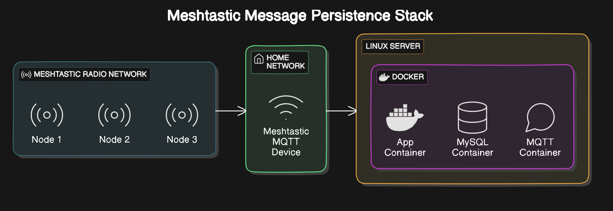

# Meshtastic Message Persistence using Docker Containers

Containerised version of Brad H's Meshtastic-MQTT-MySQL application, full credits to Brad for his awesome solution for Meshtastic message persistence! 

Link to Brads Repo here: https://github.com/brad28b/meshtastic-mqtt-mysql

I saw an opportunity to containerise and simplify the deployment process using Docker ❤️ this also makes the solution portable between AMD64 & ARM.

To quickly deploy this solution, clone this repository and deploy the stack as described on my blog page:

https://beardbench.isogen.io/posts/meshtastic_persistent_messages/index.html